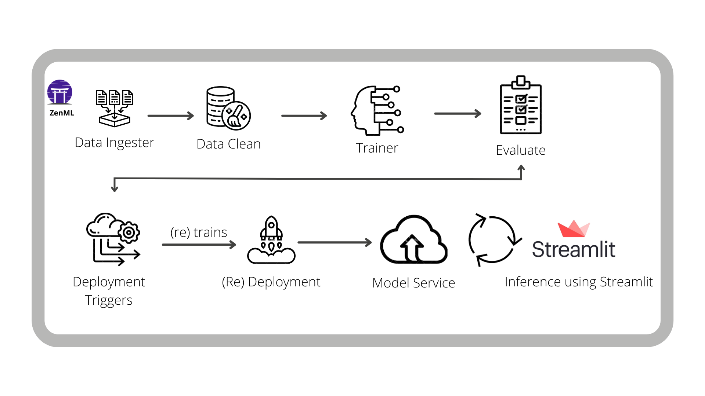

# Predicting Customer Satisfaction in E-Commerce Before the Order

# Table of Contents

1. [Project Overview](#project-overview)
2. [Setting Up the Python Environment](#setting-up-the-python-environment)
3. [Solution Overview](#solution-overview)
    - [Training Pipeline](#training-pipeline)
    - [Deployment Pipeline](#deployment-pipeline)
4. [Diving into the Code](#diving-into-the-code)
5. [Conclusion](#conclusion)

# Project Overview <a id="project-overview"></a>
In my latest project, I've taken up the intriguing challenge of predicting customer satisfaction for e-commerce purchases using historical data. I'm utilizing the [Brazilian E-Commerce Public Dataset by Olist](https://www.kaggle.com/datasets/olistbr/brazilian-ecommerce), which encompasses over 100,000 orders from 2016 to 2018 across various Brazilian marketplaces. This dataset is a goldmine of information, providing insights into order status, pricing, payment methods, freight performance, customer locations, product attributes, and most importantly, customer reviews.

The goal of my project is to forecast the customer satisfaction score for future orders based on these multifaceted features. To achieve this in a real-world scenario, I've employed [ZenML](https://zenml.io/), an innovative tool to create a production-ready pipeline for predicting these satisfaction scores. This repository serves as a demonstration of how [ZenML](https://github.com/zenml-io/zenml), in combination with [MLflow](https://mlflow.org/), can be leveraged to build and deploy efficient and scalable machine learning pipelines.

Through this project, I aim to showcase:

- My ability to utilize ZenML as a foundational framework for machine learning projects.
- The integration of MLflow for streamlined deployment and effective tracking of machine learning models.
- The ease and efficiency of building and deploying machine learning pipelines to handle real-world data and scenarios.

# Setting Up the Python Environment <a id="setting-up-the-python-environment"></a>
Within the Python environment of your choice, run:
```bash
git clone https://github.com/zenml-io/zenml-projects.git
cd zenml-projects/customer-satisfaction
pip install -r requirements.txt
```

Starting with ZenML 0.20.0, ZenML comes bundled with a React-based dashboard. This dashboard allows you
to observe your stacks, stack components and pipeline DAGs in a dashboard interface. To access this, you need to [launch the ZenML Server and Dashboard locally](https://docs.zenml.io/user-guide/starter-guide#explore-the-dashboard), but first you must install the optional dependencies for the ZenML server:

```bash
pip install zenml["server"]
zenml up
```

If you are running the `run_deployment.py` script, you will also need to install some integrations using ZenML:

```bash
zenml integration install mlflow -y
```

Furthermore, running the `run_deployment.py` script in this project required specific integrations with ZenML. I ensured that these integrations, particularly MLflow, were correctly installed. MLflow is integral to this project, as it serves as both the experiment tracker and model deployer within the ZenML stack. 

```bash
zenml integration install mlflow -y
```

Configuring the ZenML stack with MLflow components was a straightforward process. I registered the MLflow experiment tracker and model deployer and then set up a new stack with these components. This setup was vital for the successful execution of the project, as it enabled me to track experiments, log metrics, and deploy models seamlessly.

The project can only be executed with a ZenML stack that has an MLflow experiment tracker and model deployer as a component. Configuring a new stack with the two components are as follows:

```bash
zenml integration install mlflow -y
zenml experiment-tracker register mlflow_tracker --flavor=mlflow
zenml model-deployer register mlflow --flavor=mlflow
zenml stack register mlflow_stack -a default -o default -d mlflow -e mlflow_tracker --set
```

Through these steps, I've established a robust environment tailored to the needs of my project, leveraging the power of ZenML and MLflow to build a scalable and efficient machine learning workflow.

# Solution Overview <a id="solution-overview"></a>

In my pursuit to build a practical workflow for predicting customer satisfaction scores, I realized that merely training a model once wouldn't suffice. Instead, I've developed an end-to-end pipeline that not only predicts but also continuously updates and deploys the machine learning model. This approach ensures that the business can utilize the latest model for informed decision-making.

This pipeline, designed to be flexible and scalable, can be deployed to the cloud and adapted according to the project's evolving needs. It meticulously tracks every aspect of the process, from raw data inputs to the model parameters and prediction outputs, ensuring comprehensive monitoring and analysis.

In this project, I've placed particular emphasis on the [MLflow integration](https://github.com/zenml-io/zenml/tree/main/examples) within ZenML. Utilizing MLflow, I've managed to track key metrics and parameters effectively, and its deployment capabilities allowed for seamless model implementation.
### Training Pipeline <a id="training-pipeline"></a>

The training pipeline I've designed encompasses several critical steps:

- `ingest_data`: Responsible for data ingestion and DataFrame creation.
- `clean_data`: Cleans the data, ensuring its quality and relevance.
- `train_model`: Focuses on training the model, with MLflow autologging used for saving.
- `evaluation`: Evaluates the model and logs metrics using MLflow autologging.

### Deployment Pipeline <a id="deployment-pipeline"></a>

Beyond the standard training, I've crafted a `deployment_pipeline.py` that extends the initial process. This pipeline not only processes and trains the model but also deploys it as a prediction server, subject to meeting predefined evaluation criteria. This criteria, based on the [MSE](https://scikit-learn.org/stable/modules/generated/sklearn.metrics.mean_squared_error.html), ensures only high-performing models are deployed.

The deployment pipeline leverages ZenML's MLflow tracking for logging hyperparameters, model details, and evaluation metrics. This setup enables the local MLflow deployment server to automatically update and serve the latest model that meets our accuracy thresholds, creating a dynamic and responsive system.

Through this project, I've demonstrated not just my technical skills in machine learning but also my ability to create and manage a robust, real-world applicable data science workflow. It reflects my commitment to blending technical expertise with practical business solutions.

To round it off, we deploy a Streamlit application that consumes the latest model service asynchronously from the pipeline logic. This can be done easily with ZenML within the Streamlit code:

```python
service = prediction_service_loader(
   pipeline_name="continuous_deployment_pipeline",
   pipeline_step_name="mlflow_model_deployer_step",
   running=False,
)
...
service.predict(...)  # Predict on incoming data from the application
```

While this ZenML Project trains and deploys a model locally, other ZenML integrations such as the [Seldon](https://github.com/zenml-io/zenml/tree/main/examples/seldon_deployment) deployer can also be used in a similar manner to deploy the model in a more production setting (such as on a Kubernetes cluster). We use MLflow here for the convenience of its local deployment.



# Diving into the Code <a id="diving-into-the-code"></a>

You can run two pipelines as follows:

- Training pipeline:

```bash
python run_pipeline.py
```

- The continuous deployment pipeline:

```bash
python run_deployment.py
```

# Conclusion <a id="conclusion"></a>

As I reflect on the completion of this project, I am struck by the profound learning journey it has taken me on, particularly in the realms of Machine Learning Operations (MLOps), ZenML, and the entire MLOps lifecycle. This project was not just about predicting customer satisfaction in e-commerce; it was a deep dive into the intricate processes that underpin effective machine learning in practice.

Throughout this endeavor, I have gained invaluable experience in navigating the MLOps landscape, a field that stands at the crossroads of machine learning and operational excellence. The practical application of concepts such as continuous integration, continuous deployment, and model monitoring has been enlightening. It has offered me a holistic view of how machine learning models can be developed, deployed, and managed efficiently in a real-world setting.

The use of ZenML has been instrumental in this learning curve. It provided an intuitive and powerful framework that simplified the complexity of MLOps. The ability to construct, manage, and scale machine learning pipelines seamlessly has been a pivotal aspect of this project. ZenML’s integration with tools like MLflow further enriched my understanding of model tracking, versioning, and deployment, ensuring that the models I developed were not only accurate but also robust and deployable.

This project has also been an exploration of the entire MLOps lifecycle, from data ingestion and preprocessing to model training, evaluation, and deployment. Each stage brought its own challenges and learnings, contributing to a comprehensive understanding of the end-to-end process. It underscored the importance of maintaining quality and efficiency at each step to ensure the overall success of a machine learning project.

In conclusion, this project has been more than an academic or technical exercise; it has been a transformative experience that has equipped me with essential skills in MLOps. It has deepened my understanding of how to effectively deploy machine learning models and manage their lifecycle in production environments. I am eager to apply these insights in future projects and continue my journey in the ever-evolving field of machine learning and MLOps.

